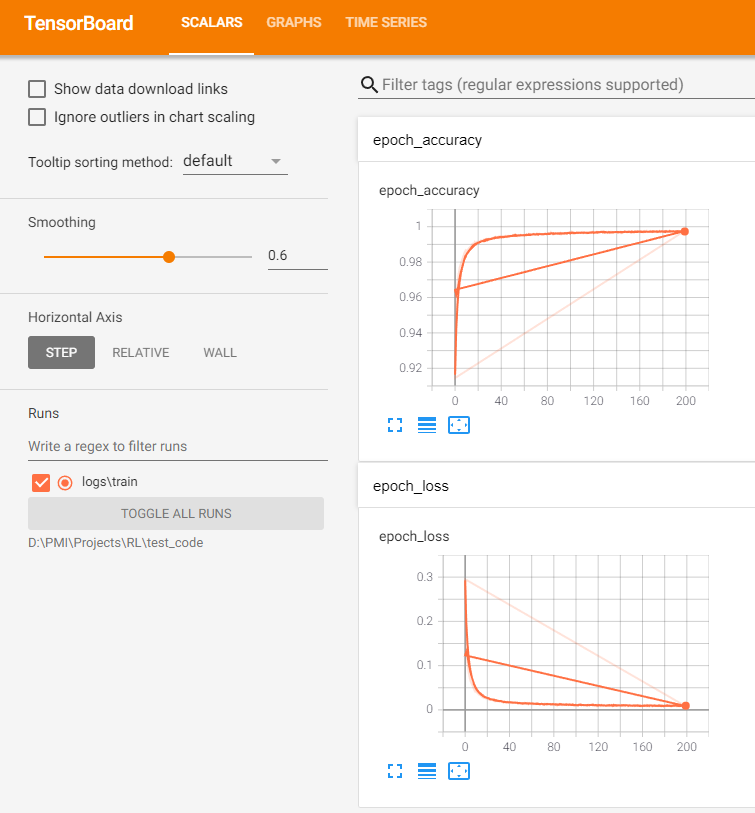
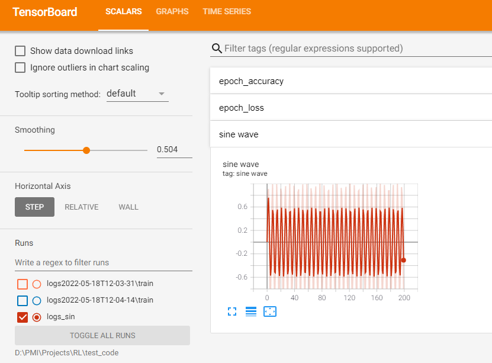

# Reinforcement-Learning-For-Research
Unfortunately, the original repository "Reinforcement-Learning-Perceptron" has to be set to private because I found that there're still some experiments must be done. The repository will be published once all the related experiments are finished. Instead, I establish a new repository to help the beginner to apply reinforcement learning tools on scientific research. I will introduce the relevant code in the following points:


## 1. Basic use of Tensorboard

Run tensorboard：

```powershell
tensorboard --logdir=<directory_name>
```

where directory_name indicates the directory to be monitored. Tensorboard automatically detects the event file in the directory. Enter the command and you'll get a URL, which opens up as tensorboard.

### 1.1 Neural Network Training

```python
import tensorflow as tf

# Load and normalize MNIST data
mnist_data = tf.keras.datasets.mnist
(X_train, y_train), (X_test, y_test) = mnist_data.load_data()
X_train, X_test = X_train / 255.0, X_test / 255.0

# Define the model
model = tf.keras.models.Sequential([
tf.keras.layers.Flatten(input_shape=(28, 28)),
tf.keras.layers.Dense(128, activation='relu'),
tf.keras.layers.Dropout(0.2),
tf.keras.layers.Dense(10, activation='softmax')
])

# Compile the model
model.compile(
optimizer='adam',
loss='sparse_categorical_crossentropy',
metrics=['accuracy'])

tf_callback = tf.keras.callbacks.TensorBoard(log_dir="./logs")
model.fit(X_train, y_train, epochs=5, callbacks=[tf_callback])
```

This is the simplest tensorflow code. The last two callback lines create a link to tensorboard, which will create a content that tensorboard can read in the current directory./logs.



Note that here are two repeated training exactly the same, the second training of step1 will be connected from the first training of step200, so it will cause inconvenience. You can adopt[(21条消息) tensorboard多个events文件显示紊乱的解决办法_shahuzi的博客-CSDN博客_tensorboard多个文件](https://blog.csdn.net/shahuzi/article/details/81223980)，to distinguish logs by introducing time as a marker:

```python
from datetime import datetime
TIMESTAMP = "{0:%Y-%m-%dT%H-%M-%S/}".format(datetime.now())
tf_callback = tf.keras.callbacks.TensorBoard(log_dir="./logs"+TIMESTAMP)
model.fit(X_train, y_train, epochs=10, callbacks=[tf_callback])
```

### 1.2 For custom variables

```python
# Specify a directory for logging data
logdir = "./logs"

# Create a file writer to write data to our logdir
file_writer = tf.summary.create_file_writer(logdir)

# Loop from 0 to 199 and get the sine value of each number
for i in range(200):
    with file_writer.as_default():#使用这个记录器
        tf.summary.scalar('sine wave', np.math.sin(i), step=i)
```

The above considerations generate a sin function, visualized with tensorboard, and the result is shown below:




## 2. Preliminary Code

For reinforcement learning programming, there are two python packages:

- Gym：[Gym Documentation (gymlibrary.ml)](https://www.gymlibrary.ml/)；
- Stable-Baselines3：[Stable-Baselines3 Docs - Reliable Reinforcement Learning Implementations — Stable Baselines3 1.5.1a6 documentation](https://stable-baselines3.readthedocs.io/en/master/index.html)；


### 2.1 An example of DQN

**Q1：**How to use the gym and sb3 for the simplest reinforcement training？

1. Get an environment env using gym

```python
import gym
env_name = "LunarLander-v2"		  # 一个月球着陆的游戏
env = gym.make(env_name)          # 导入注册器中的环境

episodes = 10
for episode in range(1, episodes + 1):
    state = env.reset()           # gym风格的env开头都需要reset一下以获取起点的状态
    done = False
    score = 0

    while not done:
        env.render()              # 将当前的状态化成一个frame，再将该frame渲染到小窗口上
        action = env.action_space.sample()     # 通过随机采样获取一个随即动作
        n_state, reward, done, info = env.step(action)    # 将动作扔进环境中
        score += reward
    print("Episode : {}, Score : {}".format(episode, score))

env.close()

```

2. Use the RL algorithm in stable_baseline3

```python
import stable_baselines3
from stable_baselines3 import DQN
from stable_baselines3.common.vec_env.dummy_vec_env import DummyVecEnv
from stable_baselines3.common.evaluation import evaluate_policy 

# device test
print(stable_baselines3.common.utils.get_device(device='auto'))

# set env
env_name = "LunarLander-v2"
env = gym.make(env_name)
env = DummyVecEnv([lambda : env])

# set model
model = DQN(
    "MlpPolicy", 
    env=env, 
    learning_rate=6.3e-4,
    batch_size=128,
    buffer_size=50000,
    learning_starts=0,
    gamma = 0.99,
    target_update_interval=250,
    train_freq = 4,
    gradient_steps = -1,
    exploration_fraction = 0.12,
    exploration_final_eps = 0.1,
    policy_kwargs={"net_arch" : [256, 256]},
    verbose=1,
    tensorboard_log="./tensorboard/LunarLander-v2/"
)

model.learn(total_timesteps=1e5)
mean_reward, std_reward = evaluate_policy(model, env, n_eval_episodes=10, render=False)
model.save("LunarLander3.pkl")
env.close()
```

3. Test in the gym after training

```python
env = gym.make(env_name)
model = DQN.load("LunarLander3.pkl")

state = env.reset()
done = False 
score = 0
while not done:
    action, _ = model.predict(observation=state)
    state, reward, done, info = env.step(action=action)
    score += reward
    env.render()
env.close()
```


### 2.2 Custom Gym

**Q2：**How to customize a game environment?

It is not difficult to find that sb3 can interact directly through the interface of the gym, which also means that if it is necessary to use the package of sb3 for RL training, the research environment needs to be packaged into a gym environment. Customize the way of gym refers to [定制OpenAI Gym学习环境（一） - 知乎 (zhihu.com)](https://zhuanlan.zhihu.com/p/102920005)；

To be specific, first create a configuration file with the following hierarchical directories:

```
custom-gym/
|-- README.md
|-- setup.py
|-- custom_gym/
|  |-- __init__.py
|  |-- envs/
|  |  |-- __init__.py
|  |  |-- custom_env.py
|  |  |-- custom_env_extend.py
```

（1）setup.py Containing the name of the environment package and the pkgs involved,

```python
from setuptools import setup

setup(name='custom_gym',        # Secondary directory
    version='0.1',
    install_requires=['gym']    # And any other dependencies foo needs
)
```

Notice here that custom_gym becomes the name of a package; instal_requires no version number, which will result in uninstallation and reinstallation.

（2）First layer init.py

```python
from gym.envs.registration import register

register(
    id='custom_env-v0',                                  
    entry_point='custom_gym.envs:CustomEnv',            
)
register(
    id='custom_env_extend-v0',
    entry_point='custom_gym.envs:CustomEnvExtend',
)
```

The first layer init registers the environment and gives the environment name. Note that the environment name must include the version number, entry_point, and inti at the second layer to specify the location of the environment class. register is called in the gym, and you can enter the register. It's like a wrapper, and it's designed to bring in pre-existing Settings, like the maximum number of iterations in cartpole, so it's used in a lot of code,

```python
env = env.unwrapped()
```

to get the original class;

（3）Second layer init.py

```python
from custom_gym.envs.custom_env import CustomEnv
from custom_gym.envs.custom_env import CustomEnvExtend
```

The environment extension points to two more environment definition files, which contain what needs to be defined for the environment.

（4）Initialization

Finally, under the custom-gym directory,

```powershell
pip install -e .
```

This command puts the custom-gym package into the conda list and specifies that it is an editable development package so that it can be invoked from any path. And finally, a simple test,

```python
import gym
import custom_gym
gym.make("custom_env-v0")
```

If successful, there is no error, and the custom_gym package can be found in the conda list, making it easy to call from any folder.